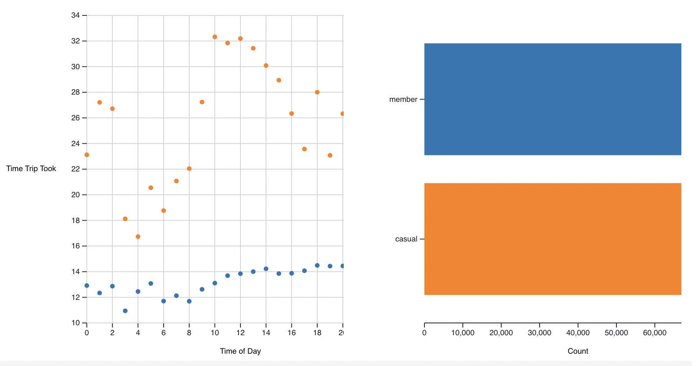

# Project 2 Angelica Villegas Salazar

## Website

https://sites.google.com/uic.edu/cs424-p3

## Github Repository Description
This repository has the exact html I used on the google site, seperated by graph. In the test section it has the html/javascript seperated to make it a bit more readable. These were the files where I did my original testing of the graphs on.

## Data Set Description

### Data Set Information
Using Divvy bike data from July 1st to July 8th 2022([https://ride.divvybikes.com/system-data]). It has 157959 entries

Processed the data using Pandas in python. In doing this I added and removed columns. Additionally, the data was filtered to only contain dates from July 1st to July 8th so that the data could be uploaded to observable. I then pulled the json from my observable notebook (https://observablehq.com/@angelica-v/project-2) that contained any additional filtering I created.

### Data Fields

rideType: d['rideable_type']  (Bike type data: docked/electric/classic) 
member: d['member_casual'], (Member type: casual/member) 
startDates: d['StartDates'], (Start Dates: date that the trip started (format. 2022-07-05)) 
endDates: d['EndDates'],(End Dates: date that the trip started (format. 2022-07-05)) 
startTime: d['StartTime'],(Start Time: time that the trip started (format. 08:24:32, 24h time)) 
endTime: d['EndTime'], (End Time: time that the trip ended (format. 08:24:32, 24h time)) 
startStation: d['start_station_name'],(Start Station Name: the name of the station trip started at) 
endStation: d['end_station_name'],(End Station Name: the name of the station trip ended at) 
fullStartTime: d['started_at'], (Full Start Time: full start time includes date and time (format. 2022-07-06 13:47:18)) 
fullEndTime: d['ended_at'], (Full End Time: full end time includes date and time (format. 2022-07-06 13:47:18)) 
startLatitude: d['start_lat'], (Start Latitude: start latitude of trip in degrees) 
startLongitude: d['start_lng'],(Start Longitude: start longitude of trip in degrees) 
endLatitude: d['end_lat'], (End Latitude: end latitude of trip in degrees) 
endLongitude: d['end_lng'], (End Longitude: end longitude of trip in degrees) 
zipCode: d['zip'],(Zip Code: added using pandas, the zip code of where the trip started) 
roundTrip: d['StartEqEnd'], (Round Trip: added using pandas, returns 1 if the trip starts and ends at the same location else returns 0) 
timeTook: d['TimeTook'], (Time Took: added using pandas, The time in minutes that the trip took, calculated by subtracting start time from end time) 
rideId: d['ride_id'] (Ride Id: id for each ride) 

# Data & Domain Questions

In going through this project, there were four main areas I wanted to examine, zip code trip frequency, mean trip time depending on bike type, mean trip time depending on user type (member vs. casual), and ratio of user type (member and casual) that start and end at the same station.

1. Domain: Where to do most users start their trips and does their location change how long they ride for? // Data: How does the number of rides distribute across Chicago zip codes? How does the mean trip time by hour of day change by Zip Code (and how does that distribute by zip code)?
2. Who makes up the bulk of travel time on Divvy bikes during the fourth of July week/weekend?  // How does the mean trip time differ between members and casual users by day and by hour for July 1st to July 8th? What is the ratio of members to casual users?

##  Domain: Where to do most users start their trips and does their location change how long they ride for? // Data: How does the number of rides distribute across Chicago zip codes? How does the mean trip time by hour of day change by Zip Code (and how does that distribute by zip code)?

 

### Hypotheses
Zip Codes that are closer to the lake, have higher ridership. Addtitionally, through the hours, the loop zip codes will be more popular during day hours as workers will be biking and tourists exploring the city. However, the ratios will remain fairly similar throughout the day.

### Why
I wanted to look at zip code frequency and see how does the mean trip change by zip code and by hour. Do people take longer trips in the day, or ngith? 

I decided to approach this in two part. With a a bar chart and a scatter plot (which are interactable)

 

I first decided to look at how does the number of rides distribute across Chicago zip codes. For this visualization I chose a bar chart. This is due to seeing how a quantity(# of rides) compares to a category(zip codes)

In comparison then I decided to shift from the bar graph to the interactable. The interactable graph was created two quantities(the count of the hour, the mean time the trip took). Thus, I used a scatter plot. This data is split into categories between zip codes. So it calculates the mean time at each hour for each zip code. Then the dots are colored based on this. I decided to make the scatterplot interactable and adding a bar chart to the side. When you select the different points in the scatterplot, the bar chart shows the number of riders split between the zip codes selected. I chose to do this to see if the ratio changed based on time.

### Findings
Through the first graph it was found that a large majority of rides start in the 60614 zip code, followed by 60611. This is similar to my hypothesis as these zip codes are near Lincoln Park/the lake front, and north loop respectively.

There are some higher mean times than expected in a few zip codes. However the cumulative riders are less than 5 so it is likely one ride which is bring up the mean time.

Additionally you can see there are no large peaks of when the mean time is larger by zip code. The count of riders increases during daytime hours which is to be expected.

 

### Plots

#### Zip Code Interactable w/ scatter and bar chart

#### Zip Code Interactable w/ scatter and bar chart: 4am

#### Zip Code Interactable w/ scatter and bar chart: 6am

#### Zip Code Interactable w/ scatter and bar chart: 11am

 

## Question: Domain: Who makes up the bulk of travel time on Divvy bikes during the fourth of July week/weekend?  //  Data: How does the mean trip time differ between members and casual users by day and by hour for July 1st to July 8th? What is the ratio of members to casual users?

 

The first thing I want to examine is general usage of the bikes, to do this I looked at the mean time each user took on trips over a time period between both the casual and member users. 

 
### Hypothesis

I believe that mean trip times will be higher for both groups through the weekend (especially as it is a holiday weekend), I would also include Monday as part of this trend. Additionally, I expect through the weekend members and casual bikers will have equal mean trips but in the week, I expect member bikers will have lower mean trip times as they tend to have a regular route they are going on.

Additionally, through the hours, the loop zip codes will be more popular during day hours as workers will be biking and tourists exploring the city. However, the ratios will remain fairly similar throughout the day.

### Why

I decided to first look at how does the mean trip time differ between members and casual users by day from July 1st to July 8th?

For this first visualization I chose a line graph as I was watching two (member versus casual) quantities (average trip length) changing over time (by day).

The second visualization in comparison to  question 1, this graph was created two quantities(the count of the hour, the mean time the trip took). Thus, I used a scatter plot. This data is split into categories between zip codes. So it calculates the mean time at each hour for each zip code. Then the dots are colored based on this. I decided to make the scatterplot interactable and adding a bar chart to the side. When you select the different points in the scatterplot, the bar chart shows the number of riders split between the zip codes selected. I chose to do this to see if the ratio changed based on time.

### Findings

I discovered that through the entire week, member riders have a distinctly lower mean trip time than a casual rider. Additionally the mean trip time significantly peaks for casual riders on the weekend, however there is a bit less of a spike of the mean trip time for the member users in the weekend.

Further down, I look at how the mean time of a trip compares to hour of the day and how that is distributed among casual and member bikers.

For the scatter plot shown below it can be seen that the mean time took by hour appears more constant for member users than casual users where there is a dip in trip duration during the early morning/evening and a peak from 10:00am - 2:00pm

Additionally, there are fairly equal member and casual riders through this week

Finally, Through the hours, the loop zip codes will be more popular during day hours as workers will be biking and tourists exploring the city. However, the ratios will remain fairly similar throughout the day.

### Plots
#### Mean trip time a rider took split by member and casual riders over the week

#### Mean trip time a rider took split by member and casual riders over the week (Casual View)

#### Mean trip time a rider took split by member and casual riders over the week (Member View)

#### Member versus casual user, mean trip time by hour the trip started. 

#### Member versus casual user, mean trip time by hour the trip started. 5 am view

#### Member versus casual user, mean trip time by hour the trip started. 11 am view

 

